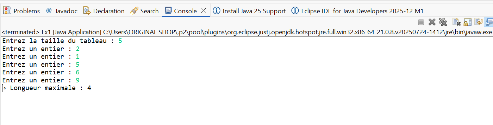
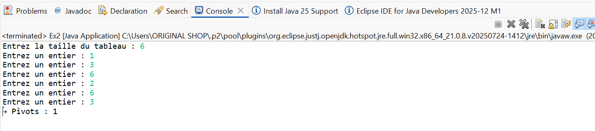
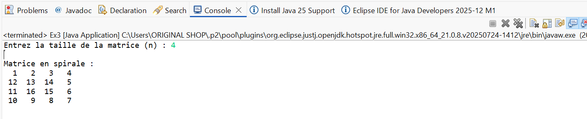
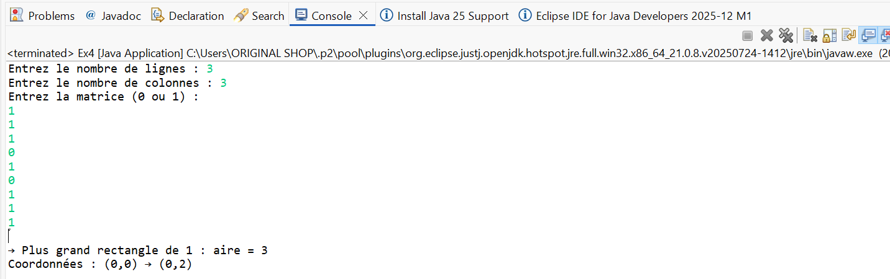
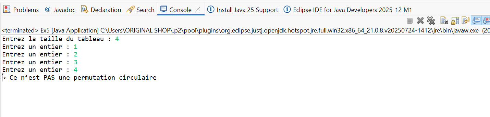
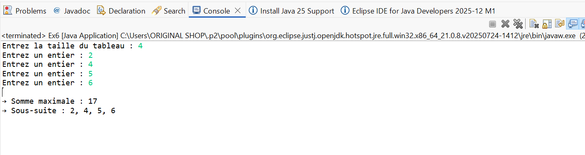
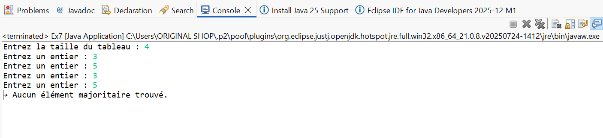
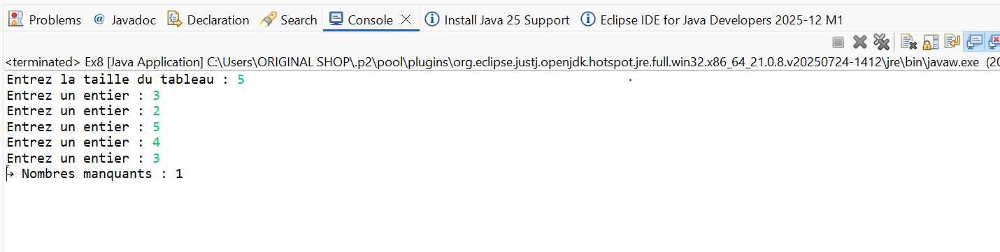
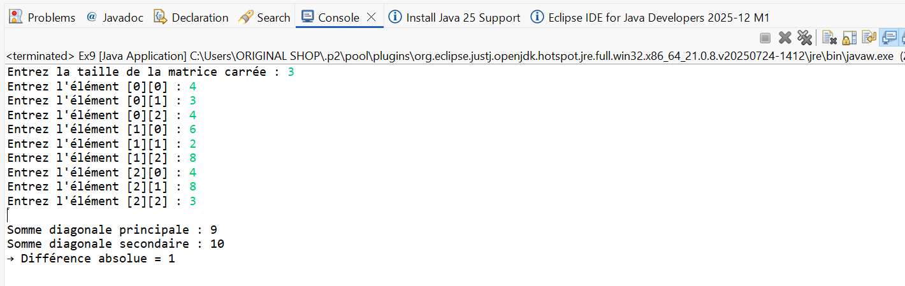

# 🧠 TP2 - Programmation JAVA

Ce projet contient les exercices du TP2 en JAVA.

## 📸 Captures d’écran

Voici les résultats d’exécution :


 Exercice 1 :


Exercice 2 :


Exercice 3 :


Exercice 4 :


Exercice 5 :


Exercice 6 :


Exercice 7 :


Exercice 8 :


Exercice 9 :



---

## ⚙ Compilation
```bash
g++ main.cpp -o main
./main